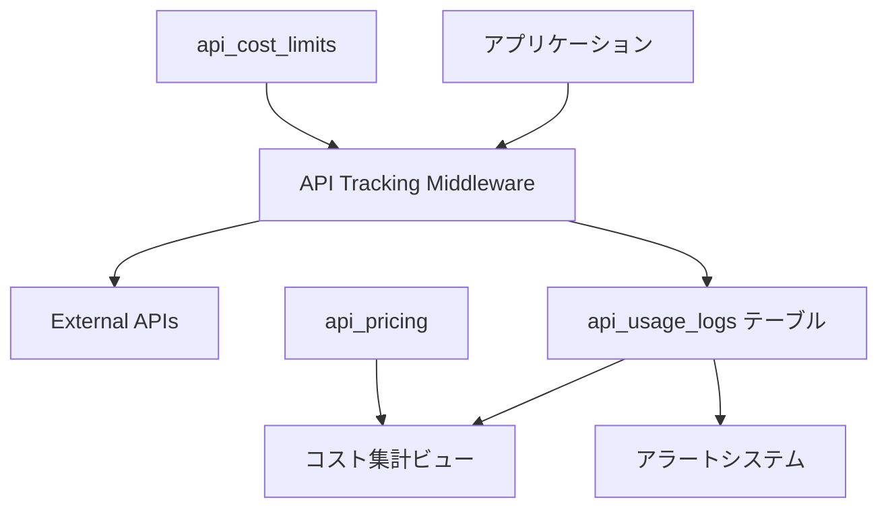

# API追跡システム ドキュメント

## 概要

Biz SearchアプリケーションのAPI追跡システムは、外部API（Google Maps、OpenAI等）の使用状況とコストを監視・管理するためのシステムです。

## 目的

1. **コスト管理**: API使用料金の追跡と予算管理
2. **パフォーマンス監視**: レスポンス時間とエラー率の監視
3. **使用量分析**: API使用パターンの分析と最適化
4. **コンプライアンス**: 使用履歴の記録と監査

## システム構成



## 対応APIプロバイダー

### Google Maps Platform

| エンドポイント | 用途 | 料金（USD） |
|------------|------|-----------|
| geocoding | 住所→座標変換 | $0.005/request |
| reverse_geocoding | 座標→住所変換 | $0.005/request |
| places | 場所検索 | $0.017/request |
| streetview | Street View画像 | $0.007/request |

### OpenAI

| モデル | 用途 | 入力料金 | 出力料金 |
|-------|------|---------|---------|
| gpt-4 | 高度な文章処理 | $0.03/1K tokens | $0.06/1K tokens |
| gpt-3.5-turbo | 一般的な処理 | $0.0015/1K tokens | $0.002/1K tokens |

### その他

- **DeepL**: 翻訳API
- **AWS Textract**: OCR処理
- **Azure Cognitive Services**: 各種AI処理

## データベース構造

### api_usage_logs テーブル

APIの使用履歴を記録する中核テーブル。各APIコールの詳細情報を保存。

```sql
CREATE TABLE api_usage_logs (
    id uuid PRIMARY KEY,
    user_id uuid NOT NULL,
    project_id uuid,
    api_provider text NOT NULL,
    api_endpoint text NOT NULL,
    request_count integer DEFAULT 1,
    response_status text NOT NULL,
    response_time_ms integer,
    cost_amount numeric(10, 6),
    cost_currency text DEFAULT 'USD',
    request_payload jsonb,
    response_summary jsonb,
    error_message text,
    created_at timestamptz DEFAULT now()
);
```

### api_cost_limits テーブル

コスト上限を管理。ユーザーまたはプロジェクト単位で設定可能。

```sql
CREATE TABLE api_cost_limits (
    id uuid PRIMARY KEY,
    user_id uuid,
    project_id uuid,
    api_provider text NOT NULL,
    limit_type text NOT NULL, -- 'monthly', 'daily', 'per_project'
    limit_amount numeric(10, 2) NOT NULL,
    alert_threshold numeric(3, 2) DEFAULT 0.8,
    is_active boolean DEFAULT true
);
```

## 実装方法

### 基本的な使用方法

```typescript
import { trackApiUsage } from '@/lib/api-tracking';

// Google Maps Geocoding APIの例
const result = await trackApiUsage(
  'google_maps',
  'geocoding',
  async () => {
    // 実際のAPI呼び出し
    return await googleMapsClient.geocode({ address });
  },
  {
    projectId: currentProjectId,
    estimatedCost: 0.005,
    requestPayload: { address }
  }
);
```

### バッチ処理の例

```typescript
// 複数の住所を一括でジオコーディング
const results = await trackApiUsage(
  'google_maps',
  'geocoding',
  async () => {
    return await Promise.all(
      addresses.map(addr => googleMapsClient.geocode({ address: addr }))
    );
  },
  {
    projectId: currentProjectId,
    estimatedCost: addresses.length * 0.005,
    requestPayload: { 
      addressCount: addresses.length,
      sampleAddresses: addresses.slice(0, 3)
    }
  }
);
```

## コスト計算

### 自動計算

各APIプロバイダーの料金体系に基づいて自動計算：

```typescript
// Google Maps: リクエスト単位
const geocodingCost = requestCount * 0.005;

// OpenAI: トークン単位
const gpt4Cost = (inputTokens * 0.03 + outputTokens * 0.06) / 1000;
```

### 手動設定

特殊なケースでは手動でコストを指定：

```typescript
await trackApiUsage(
  'custom_api',
  'special_endpoint',
  apiCall,
  {
    estimatedCost: calculateCustomCost(),
    costCurrency: 'JPY'
  }
);
```

## 月次レポート

### コストサマリー取得

```sql
-- 月次コストサマリー
SELECT * FROM get_monthly_api_cost_summary(
  auth.uid(),
  '2024-01-01'::date
);

-- 詳細な使用状況
SELECT 
  api_provider,
  api_endpoint,
  DATE(created_at) as date,
  COUNT(*) as requests,
  SUM(cost_amount) as daily_cost,
  AVG(response_time_ms) as avg_response_time
FROM api_usage_logs
WHERE user_id = auth.uid()
  AND created_at >= DATE_TRUNC('month', CURRENT_DATE)
GROUP BY api_provider, api_endpoint, DATE(created_at)
ORDER BY date DESC, daily_cost DESC;
```

## アラート設定

### 基本的なアラート

1. **コスト上限アラート**: 80%到達時に通知
2. **エラー率アラート**: エラー率が10%を超えた場合
3. **レート制限アラート**: rate_limited状態の検出

### カスタムアラート設定

```sql
-- 月額$100の上限設定
INSERT INTO api_cost_limits (
  user_id,
  api_provider,
  limit_type,
  limit_amount,
  alert_threshold
) VALUES (
  auth.uid(),
  'all',
  'monthly',
  100.00,
  0.8  -- 80%で警告
);
```

## エラーハンドリング

### 一般的なエラー

1. **rate_limited**: API呼び出し回数制限
   - 対処: リトライまたはバックオフ

2. **quota_exceeded**: 割当量超過
   - 対処: 翌日まで待機または割当量増加

3. **timeout**: タイムアウト
   - 対処: タイムアウト時間の調整

### エラー時の記録

```typescript
try {
  // API呼び出し
} catch (error) {
  // エラーも自動的に記録される
  await trackApiUsage(
    'google_maps',
    'geocoding',
    async () => { throw error; },
    {
      errorMessage: error.message
    }
  );
}
```

## ベストプラクティス

### 1. バッチ処理の活用

```typescript
// ❌ 非効率: 個別リクエスト
for (const address of addresses) {
  await geocode(address);
}

// ✅ 効率的: バッチ処理
await geocodeBatch(addresses);
```

### 2. キャッシュの実装

```typescript
// メモリキャッシュまたはRedisを使用
const cached = await cache.get(cacheKey);
if (cached) return cached;

const result = await trackApiUsage(...);
await cache.set(cacheKey, result, ttl);
```

### 3. コスト見積もりの事前表示

```typescript
// ユーザーに事前確認
const estimatedCost = calculateEstimatedCost(items);
if (estimatedCost > 10) {
  const confirmed = await confirmDialog(
    `この操作には約$${estimatedCost}かかります。続行しますか？`
  );
  if (!confirmed) return;
}
```

## トラブルシューティング

### コスト超過の調査

```sql
-- 高コストAPIコールの特定
SELECT 
  created_at,
  api_provider,
  api_endpoint,
  request_count,
  cost_amount,
  request_payload
FROM api_usage_logs
WHERE user_id = auth.uid()
  AND cost_amount > 1.0  -- $1以上
ORDER BY cost_amount DESC
LIMIT 20;
```

### パフォーマンス問題の分析

```sql
-- 遅いAPIコールの特定
SELECT 
  api_provider,
  api_endpoint,
  AVG(response_time_ms) as avg_time,
  MAX(response_time_ms) as max_time,
  COUNT(*) as call_count
FROM api_usage_logs
WHERE created_at > NOW() - INTERVAL '24 hours'
GROUP BY api_provider, api_endpoint
HAVING AVG(response_time_ms) > 1000  -- 1秒以上
ORDER BY avg_time DESC;
```

## 今後の拡張計画

1. **リアルタイムダッシュボード**
   - Grafana連携
   - リアルタイムアラート

2. **自動最適化**
   - 使用パターン分析
   - コスト最適化提案

3. **予測分析**
   - 月末コスト予測
   - 異常検知

## 関連ドキュメント

- [実装ガイド](./implementation-guide.md)
- [コスト管理ガイド](./cost-management.md)
- [APIプロバイダー別ガイド](./provider-guides/)