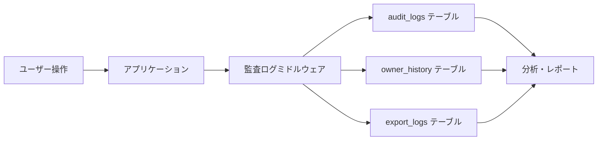

# 監査ログシステム ドキュメント

## 概要

Biz Searchアプリケーションの監査ログシステムは、システム内のすべての重要な操作を記録し、セキュリティ、コンプライアンス、トラブルシューティングのための包括的な監査証跡を提供します。

## 目的

1. **セキュリティ監査**: 不正アクセスや異常な操作の検出
2. **コンプライアンス**: 法的要件や規制への準拠
3. **トラブルシューティング**: 問題発生時の原因調査
4. **ユーザー行動分析**: システム利用状況の把握

## システム構成



## ログレベルと対象操作

### 必須記録項目（MUST LOG）

- **認証関連**: ログイン、ログアウト、パスワード変更
- **データ作成**: 新規プロジェクト、物件、所有者の作成
- **データ変更**: 重要データの更新、削除
- **データエクスポート**: CSV、Excel等のデータ出力
- **権限変更**: ユーザーロールの変更

### 推奨記録項目（SHOULD LOG）

- **検索操作**: 複雑な検索クエリ
- **一括操作**: バッチ処理、一括更新
- **API連携**: 外部システムとの連携操作

### 任意記録項目（MAY LOG）

- **閲覧操作**: 通常のデータ閲覧
- **UI操作**: フィルター変更等

## データベース構造

### audit_logs（汎用監査ログ）

```sql
audit_logs {
    id: uuid                -- レコードID
    user_id: uuid          -- 実行ユーザー
    action: text           -- 操作種別
    resource_type: text    -- リソース種別
    resource_id: uuid      -- リソースID
    changes: jsonb         -- 変更内容
    metadata: jsonb        -- メタデータ
    ip_address: inet       -- IPアドレス
    user_agent: text       -- ブラウザ情報
    created_at: timestamptz -- 実行日時
}
```

### owner_history（所有者変更履歴）

```sql
owner_history {
    id: uuid                    -- レコードID
    owner_id: uuid             -- 所有者ID
    changed_by: uuid           -- 変更実行者
    change_type: text          -- 変更種別
    old_values: jsonb          -- 変更前
    new_values: jsonb          -- 変更後
    change_reason: text        -- 変更理由
    changed_at: timestamptz    -- 変更日時
}
```

## 実装ガイド

### 基本的な使用方法

```typescript
import { logAuditEvent } from '@/lib/audit-logs';

// 基本的なログ記録
await logAuditEvent({
  action: 'create',
  resourceType: 'property',
  resourceId: propertyId,
  metadata: {
    projectId: projectId,
    propertyAddress: address
  }
});
```

### 変更の記録

```typescript
// 更新操作の詳細記録
await logAuditEvent({
  action: 'update',
  resourceType: 'owner',
  resourceId: ownerId,
  changes: {
    before: { address: '旧住所' },
    after: { address: '新住所' }
  },
  metadata: {
    updateReason: '住所変更届による更新'
  }
});
```

### バッチ操作の記録

```typescript
// 一括インポートの記録
await logAuditEvent({
  action: 'import',
  resourceType: 'property',
  metadata: {
    projectId: projectId,
    fileName: 'properties_20240118.csv',
    recordCount: 150,
    successCount: 148,
    errorCount: 2
  }
});
```

## ログの構造化

### action（操作種別）の標準値

| 値 | 説明 | 使用例 |
|----|------|--------|
| create | 新規作成 | 新規プロジェクト作成 |
| update | 更新 | 物件情報の編集 |
| delete | 削除 | 所有者情報の削除 |
| import | インポート | CSVファイルの取り込み |
| export | エクスポート | データのダウンロード |
| login | ログイン | ユーザー認証 |
| logout | ログアウト | セッション終了 |
| view | 閲覧 | 詳細情報の表示 |
| search | 検索 | データ検索実行 |

### resource_type（リソース種別）の標準値

| 値 | 説明 |
|----|------|
| property | 物件情報 |
| project | プロジェクト |
| owner | 所有者情報 |
| user | ユーザー |
| project_member | プロジェクトメンバー |
| owner_company | 会社情報 |

### metadata構造の例

```json
{
  "projectId": "uuid-here",
  "fileName": "import_20240118.csv",
  "recordCount": 150,
  "successCount": 148,
  "errorCount": 2,
  "browser": "Chrome 120.0",
  "device": "Desktop",
  "operatingSystem": "Windows 11",
  "importDuration": 5432,
  "userRole": "editor"
}
```

## クエリ例

### 最近の操作履歴

```sql
-- 直近24時間の操作履歴
SELECT 
  al.created_at,
  u.email,
  al.action,
  al.resource_type,
  al.metadata->>'projectId' as project_id
FROM audit_logs al
JOIN auth.users u ON al.user_id = u.id
WHERE al.created_at > NOW() - INTERVAL '24 hours'
ORDER BY al.created_at DESC;
```

### ユーザー別操作統計

```sql
-- 月別・ユーザー別の操作統計
SELECT 
  u.email,
  DATE_TRUNC('day', al.created_at) as date,
  al.action,
  COUNT(*) as action_count
FROM audit_logs al
JOIN auth.users u ON al.user_id = u.id
WHERE al.created_at > NOW() - INTERVAL '30 days'
GROUP BY u.email, date, al.action
ORDER BY date DESC, u.email;
```

### 異常検知クエリ

```sql
-- 短時間での大量操作検出
SELECT 
  user_id,
  COUNT(*) as operation_count,
  COUNT(DISTINCT ip_address) as ip_count
FROM audit_logs
WHERE created_at > NOW() - INTERVAL '1 hour'
GROUP BY user_id
HAVING COUNT(*) > 100  -- 1時間で100操作以上
ORDER BY operation_count DESC;
```

## データ保持ポリシー

### 保持期間

| ログ種別 | 保持期間 | アーカイブ |
|---------|---------|-----------|
| audit_logs | 1年 | 1年後にアーカイブ |
| owner_history | 無期限 | なし |
| export_logs | 3ヶ月 | 削除 |

### アーカイブ処理

```sql
-- 1年以上前のログをアーカイブテーブルに移動
INSERT INTO audit_logs_archive 
SELECT * FROM audit_logs 
WHERE created_at < NOW() - INTERVAL '1 year';

-- 元テーブルから削除
DELETE FROM audit_logs 
WHERE created_at < NOW() - INTERVAL '1 year';
```

## プライバシーとセキュリティ

### 個人情報の取り扱い

1. **最小限の記録**: 必要最小限の情報のみ記録
2. **マスキング**: センシティブ情報は部分マスキング
3. **暗号化**: データベースレベルでの暗号化

### アクセス制御

- 通常ユーザー: 自分の操作ログのみ閲覧可能
- 管理者: 全ログの閲覧が可能（別途権限設定必要）

## レポート生成

### 月次監査レポート

```sql
-- 月次サマリーレポート
SELECT 
  action,
  resource_type,
  COUNT(*) as count,
  COUNT(DISTINCT user_id) as unique_users
FROM audit_logs
WHERE created_at >= DATE_TRUNC('month', CURRENT_DATE)
GROUP BY action, resource_type
ORDER BY count DESC;
```

### セキュリティレポート

```sql
-- ログイン失敗の追跡
SELECT 
  DATE(created_at) as date,
  metadata->>'email' as attempted_email,
  ip_address,
  COUNT(*) as failed_attempts
FROM audit_logs
WHERE action = 'login_failed'
  AND created_at > NOW() - INTERVAL '7 days'
GROUP BY date, attempted_email, ip_address
HAVING COUNT(*) > 3
ORDER BY date DESC, failed_attempts DESC;
```

## ベストプラクティス

### 1. 一貫性のある記録

```typescript
// ✅ 良い例: 構造化されたメタデータ
await logAuditEvent({
  action: 'update',
  resourceType: 'property',
  resourceId: propertyId,
  changes: { before: oldData, after: newData },
  metadata: { reason: '位置情報の修正' }
});

// ❌ 悪い例: 非構造化データ
await logAuditEvent({
  action: 'something_changed',
  resourceType: 'data',
  metadata: { info: 'プロパティを更新した' }
});
```

### 2. パフォーマンスの考慮

- 非同期でログを記録
- バッチ処理でまとめて記録
- 重要度の低い操作は間引く

### 3. エラーハンドリング

```typescript
try {
  // メイン処理
  await updateProperty(data);
  
  // 成功ログ
  await logAuditEvent({ action: 'update', ... });
} catch (error) {
  // エラーログ
  await logAuditEvent({
    action: 'update_failed',
    metadata: { error: error.message }
  });
  throw error;
}
```

## トラブルシューティング

### ログが記録されない

1. RLSポリシーの確認
2. 必須フィールドの確認
3. データベース接続の確認

### パフォーマンス問題

1. インデックスの確認
2. 古いログのアーカイブ
3. バッチ記録の活用

## 今後の拡張計画

1. **リアルタイム監視**
   - WebSocketでのリアルタイム通知
   - 異常検知アラート

2. **高度な分析**
   - 機械学習による異常検知
   - ユーザー行動予測

3. **統合連携**
   - SIEMツールとの連携
   - 外部監査ツールへのエクスポート

## 関連ドキュメント

- [使用例集](./usage-examples.md)
- [ベストプラクティス](./best-practices.md)
- [法的コンプライアンス](./compliance.md)