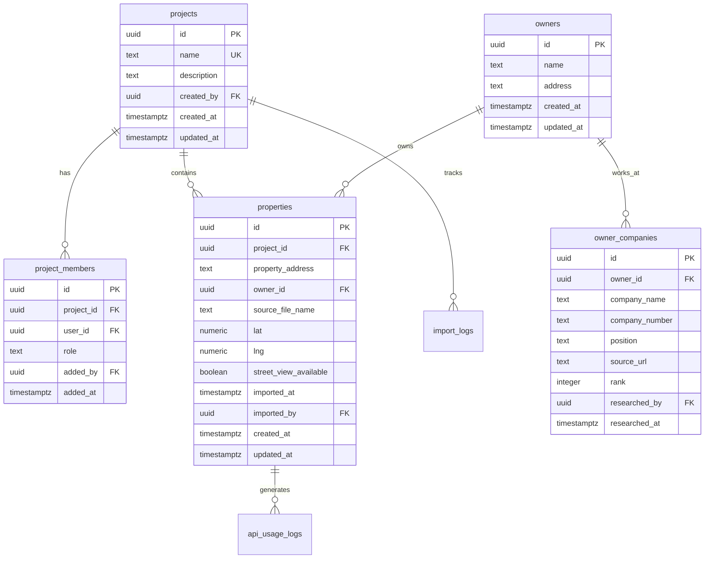
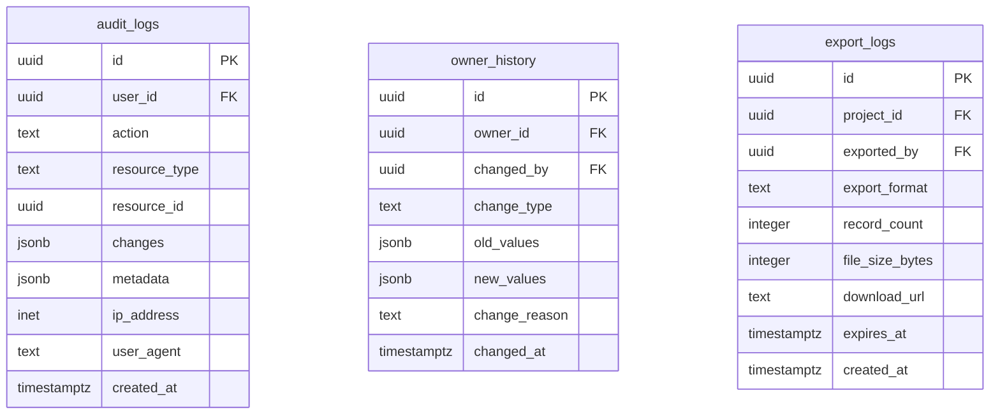
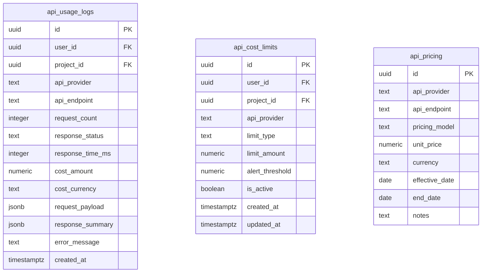

# Biz Search データベース設計ドキュメント

## 概要

Biz Searchアプリケーションのデータベース設計について説明します。本システムは、PDF解析による物件情報の抽出、位置情報の取得、所有者情報の管理を行うためのデータベース構造を持っています。

## アーキテクチャ

- **データベース**: PostgreSQL (Supabase)
- **セキュリティ**: Row Level Security (RLS)
- **認証**: Supabase Auth
- **権限管理**: 二層構造（システムレベル + プロジェクトレベル）

## テーブル構成

### コアテーブル



### 履歴・監査テーブル



### API追跡テーブル



## データベースセットアップ

### 実行順序

以下の順序でSQLファイルを実行してください：

1. **001_create_tables.sql** - 基本テーブルの作成（profilesテーブル含む）
2. **002_create_rls_policies.sql** - RLSポリシーの設定（全テーブル対応）
3. **003_sample_queries.sql** - サンプルクエリ（参考用、実行は任意）
4. **004_create_audit_tables.sql** - 監査ログテーブルの作成
5. **005_create_api_tracking.sql** - API追跡テーブルの作成

### Supabaseでの実行方法

1. Supabaseダッシュボードにログイン
2. SQL Editorを開く
3. 各SQLファイルの内容をコピー＆ペースト
4. 実行ボタンをクリック

### ローカル開発環境

```bash
# Supabase CLIを使用する場合
supabase db push

# または直接実行
psql -h localhost -p 54322 -U postgres -d postgres -f docs/db/001_create_tables.sql
psql -h localhost -p 54322 -U postgres -d postgres -f docs/db/002_create_rls_policies.sql
```

## RLS（Row Level Security）設計

### 基本方針

- **認証必須**: 全てのテーブルで認証されたユーザーのみアクセス可能
- **プロジェクトベース**: 検索プロジェクトのメンバーのみデータアクセス可能
- **役割ベース**: owner, editor, viewerの3つの役割で権限管理

### ヘルパー関数

- `user_project_ids()`: ユーザーがアクセス可能なプロジェクトIDを返す（system_owner対応）
- `user_project_role(project_id)`: 指定プロジェクトでのユーザーロールを返す（system_owner対応）

### パフォーマンス最適化

1. **インデックスの追加**: RLSで使用するカラムには必ずインデックスを作成
2. **関数のラップ**: `auth.uid()`を`SELECT`でラップして最適化
3. **SECURITY DEFINER**: 複雑なロジックは関数化して実行権限を付与

## 権限管理システム

### 二層構造の権限管理

本システムは以下の二層構造で権限を管理します：

1. **システムレベル権限（profilesテーブル）**
   - `system_owner`: システム全体の管理者
   - `user`: 通常ユーザー

2. **プロジェクトレベル権限（project_membersテーブル）**
   - `owner`: プロジェクト管理者
   - `editor`: 編集者
   - `viewer`: 閲覧者

### system_ownerの特権

`system_owner`権限を持つユーザーは以下の特権を持ちます：
- 全プロジェクトへのowner権限
- 全ユーザープロファイルの閲覧
- システム統計の閲覧
- 他ユーザーの権限昇格

### project_membersテーブルの役割

`project_members`テーブルは、プロジェクトベースの権限管理を実現する中核テーブルです。

#### カラムの説明

| カラム名 | 説明 | 用途 |
|---------|------|------|
| user_id | メンバーとして追加されるユーザーのID | 「誰が」メンバーなのかを示す |
| added_by | メンバーを追加した管理者のID | 「誰によって」追加されたかを示す（監査用） |
| role | ユーザーの権限レベル | owner, editor, viewer のいずれか |
| added_at | 追加日時 | いつメンバーに追加されたかを記録 |

#### 権限レベル

1. **owner**: プロジェクト所有者
   - 全ての操作が可能
   - メンバーの追加・削除
   - プロジェクトの削除

2. **editor**: 編集者
   - データの追加・編集・削除
   - エクスポート機能の使用
   - メンバー追加は不可

3. **viewer**: 閲覧者
   - データの閲覧のみ
   - 編集・削除は不可
   - アルバイトなど限定的なアクセスに適用

### プロジェクト作成者の扱い

- プロジェクト作成者は`projects.created_by`に記録
- トリガーにより自動的に`project_members`テーブルにownerとして登録
- 権限管理が一元化され、整合性が保たれる

## データフロー

### 1. PDFインポート

```
ユーザー → PDFアップロード → 解析 → properties/owners作成 → import_logs記録
```

### 2. 位置情報取得

```
properties選択 → Google Maps API → 座標取得 → properties更新 → api_usage_logs記録
```

### 3. 所有者情報調査

```
owner選択 → 外部調査 → owner_companies作成 → owner_history記録
```

## バックアップとメンテナンス

### 自動バックアップ

Supabaseは自動的に以下のバックアップを実行：
- **ポイントインタイムリカバリ**: 最大7日間（Proプラン）
- **日次バックアップ**: 30日間保持

### データ保持ポリシー

- **audit_logs**: 1年間保持後、アーカイブ
- **api_usage_logs**: 6ヶ月間保持後、集計データのみ保持
- **export_logs**: 3ヶ月間保持

### 定期メンテナンス

```sql
-- 古いログデータの削除（月次実行推奨）
DELETE FROM audit_logs WHERE created_at < NOW() - INTERVAL '1 year';
DELETE FROM api_usage_logs WHERE created_at < NOW() - INTERVAL '6 months';

-- インデックスの再構築（月次実行推奨）
REINDEX TABLE properties;
REINDEX TABLE api_usage_logs;
```

## トラブルシューティング

### よくある問題

1. **RLSエラー**
   - 原因: ポリシーが正しく設定されていない
   - 解決: `user_project_ids()`関数が正しく動作しているか確認

2. **パフォーマンス低下**
   - 原因: インデックスが不足している
   - 解決: EXPLAIN ANALYZEでクエリプランを確認

3. **APIコスト上限エラー**
   - 原因: コスト上限に到達
   - 解決: api_cost_limitsテーブルで上限を調整

### デバッグクエリ

```sql
-- 現在のユーザーがアクセス可能なプロジェクト
SELECT * FROM user_project_ids();

-- 特定プロジェクトでのロール確認
SELECT user_project_role('プロジェクトID');

-- API使用状況の確認
SELECT * FROM get_monthly_api_cost_summary(auth.uid());

-- ユーザーのシステムロール確認
SELECT role FROM profiles WHERE id = auth.uid();

-- system_ownerの一覧
SELECT id, email, username FROM profiles WHERE role = 'system_owner';
```

## セキュリティ考慮事項

1. **個人情報保護**
   - 所有者情報は適切にマスキング
   - エクスポート時は権限を再確認

2. **APIキー管理**
   - 環境変数で管理
   - ログには含めない

3. **監査証跡**
   - 全ての重要操作をaudit_logsに記録
   - 定期的な監査レポートの生成

## 今後の拡張計画

1. **全文検索機能**
   - PostgreSQLのFTS機能を活用
   - 物件情報・所有者情報の検索

2. **データ分析機能**
   - 統計ダッシュボード用のマテリアライズドビュー
   - 時系列分析用のテーブル

3. **外部連携**
   - 不動産データベースとの連携
   - 地図サービスとの統合

## 参考資料

- [Supabase RLS Documentation](https://supabase.com/docs/guides/auth/row-level-security)
- [PostgreSQL Performance Tips](https://wiki.postgresql.org/wiki/Performance_Optimization)
- [Database Design Best Practices](https://supabase.com/docs/guides/database/database-design)