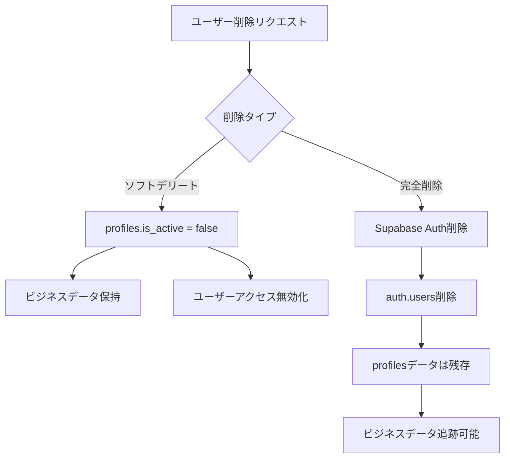

# ユーザー管理アーキテクチャ設計書

## 概要

本ドキュメントは、Biz Searchアプリケーションにおけるユーザー管理システムの現在のアーキテクチャを説明します。2025年1月に実施された重要な設計変更により、Supabase認証（auth.users）とアプリケーションのビジネスデータを分離し、より柔軟なユーザー管理を実現しています。

## 設計の背景と目的

### 課題
- クライアントからユーザー削除機能の要望
- Supabase認証ユーザーを削除すると関連するビジネスデータが失われる
- 監査証跡の保持とデータ整合性の両立が必要

### 解決策
- profilesテーブルを中心としたユーザー管理
- auth.usersからの独立性確保
- ソフトデリート機能の実装

## アーキテクチャ概要

### 1. テーブル構造

#### profiles テーブル（ユーザー管理の中心）
```sql
CREATE TABLE profiles (
    id uuid PRIMARY KEY DEFAULT auth.uid(),
    email text NOT NULL UNIQUE,
    username text NOT NULL UNIQUE,
    role text NOT NULL DEFAULT 'user' CHECK (role IN ('system_owner', 'user')),
    created_at timestamptz NOT NULL DEFAULT now(),
    updated_at timestamptz NOT NULL DEFAULT now(),
    -- ソフトデリート用カラム
    is_active boolean DEFAULT true,
    deactivated_at timestamptz,
    deactivation_reason text
);
```

**重要な特徴：**
- auth.usersへの外部キー制約なし（独立性確保）
- is_activeフラグによるソフトデリート対応
- 削除日時と理由の記録

### 2. 外部キー参照の設計

すべてのユーザー参照は`profiles`テーブルを指すように設計されています：

#### ビジネスデータテーブル（SET NULL）
削除時にNULLが設定され、データは保持されます：
- `projects.created_by → profiles(id)`
- `project_properties.added_by → profiles(id)`
- `property_ownerships.recorded_by → profiles(id)`
- `owner_companies.researched_by → profiles(id)`
- `project_members.added_by → profiles(id)`

#### 個人データテーブル（CASCADE）
削除時に連鎖削除されます：
- `project_members.user_id → profiles(id)`
- `search_patterns.user_id → profiles(id)`
- `search_api_logs.user_id → profiles(id)`

### 3. ユーザー削除フロー



## 実装詳細

### 1. ユーザー状態管理関数

```sql
-- アクティブなプロファイルIDを取得
CREATE OR REPLACE FUNCTION get_active_profile_id() 
RETURNS uuid AS $$
BEGIN
  RETURN (
    SELECT id FROM profiles 
    WHERE id = auth.uid() 
    AND is_active = true
  );
END;
$$ LANGUAGE plpgsql SECURITY DEFINER;

-- アカウント非アクティブ化
CREATE OR REPLACE FUNCTION deactivate_user_account(
  user_id uuid,
  reason text DEFAULT 'User requested'
) RETURNS void AS $$
BEGIN
  UPDATE profiles 
  SET 
    is_active = false,
    deactivated_at = now(),
    deactivation_reason = reason
  WHERE id = user_id;
END;
$$ LANGUAGE plpgsql SECURITY DEFINER;
```

### 2. インデックス設計

パフォーマンス最適化のため、以下のインデックスが作成されています：
```sql
CREATE INDEX idx_profiles_is_active ON profiles(is_active);
CREATE INDEX idx_profiles_id_is_active ON profiles(id, is_active);
```

### 3. RLSポリシーの更新

すべてのRLSポリシーは`auth.uid()`から`get_active_profile_id()`に移行済みです。これにより、非アクティブなユーザーのアクセスが自動的に制限されます。

## メリットと考慮事項

### メリット
1. **データの永続性**: ユーザー削除後もビジネスデータの追跡が可能
2. **柔軟な削除管理**: ソフトデリートと完全削除の両方に対応
3. **監査証跡**: 誰がいつ何を作成・更新したかの履歴を保持
4. **復旧可能性**: 必要に応じてアカウントの再アクティブ化が可能

### 考慮事項
1. **データ整合性**: profilesテーブルの整合性維持が重要
2. **パフォーマンス**: is_activeフラグのチェックによる若干のオーバーヘッド（インデックスで最適化済み）
3. **認証状態**: Supabase Authログイン中でもis_active=falseの場合はアクセス不可

## 今後の実装推奨事項

### 1. フロントエンド実装
```typescript
// アカウント削除API
async function deleteUserAccount(userId: string, type: 'soft' | 'hard') {
  if (type === 'soft') {
    // profilesのis_activeをfalseに設定
    await deactivateUserAccount(userId);
  } else {
    // Supabase Admin APIでauth.usersから削除
    await supabase.auth.admin.deleteUser(userId);
  }
}
```

### 2. 定期クリーンアップ
```sql
-- 90日以上非アクティブなauth.usersレコードの削除
DELETE FROM auth.users 
WHERE id IN (
  SELECT id FROM profiles 
  WHERE is_active = false 
  AND deactivated_at < now() - interval '90 days'
);
```

### 3. アカウント復旧機能
```sql
CREATE OR REPLACE FUNCTION reactivate_user_account(user_id uuid)
RETURNS void AS $$
BEGIN
  UPDATE profiles 
  SET 
    is_active = true,
    deactivated_at = NULL,
    deactivation_reason = NULL
  WHERE id = user_id;
END;
$$ LANGUAGE plpgsql SECURITY DEFINER;
```

## まとめ

この設計により、Supabase認証とビジネスデータを適切に分離し、ユーザー削除時もデータの整合性と追跡可能性を維持できる柔軟なシステムを実現しました。クライアントの要望に応えながら、ビジネス要件を満たす堅牢なアーキテクチャとなっています。